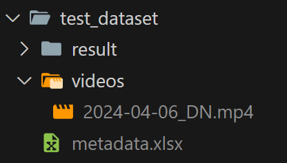

# Unhealthy Dataset Generator

- Initiate a [virtual environment](https://www.freecodecamp.org/news/how-to-setup-virtual-environments-in-python/):

```
python -m venv unhealthy-dataset-generator-env
```

Windows: 
```
unhealthy-dataset-generator-env\Scripts\activate.bat
```

MacOS: 
```
source ./unhealthy-dataset-generator-env/bin/activate
```

- Install dependencies: `pip install -r requirements.txt`


- Execute the script: `python main.py`

## Instructions

- The entire project works with a config.json. Check `default_config.json` to understand the structure.
    - `path` is where the script will read the `metadata.xlsx` and videos. It will look something like this:
    
    - `tip_values` are the values the script will get according to the `metadata.xlsx` column "tip". In this particular case, only 1 will be discarded.
    - `tv_channels_mapping` is the mapping between numbers and the channels. 1= is Disney for example. Check column "can". This setting is important because it's how the script will read the videos. So, for example, if the value is 1 on "can", the script will check every single video that ends with `_DN.mp4`.
    - `videos_metadata` details at what time a video starts and how the video crop should be (for crop values, check `test_custom_crop_params.py`)
- To check a particular video, you should populate `metadata.xlsx` with the data related to the video. For example, if you want to test `2024-04-06_DN.mp4`, you should filter "can" to 1 and "fec" to 06-04-24.
- The output of the script will be on `path/result`. Every image has the following structure: video name where the it was extracted + id from `metadata.xlsx`("cod" column) + counter id + .jpg.   
