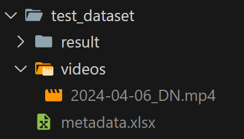

# Unhealthy Dataset Generator

- Initiate a [virtual environment](https://www.freecodecamp.org/news/how-to-setup-virtual-environments-in-python/):

```
python -m venv unhealthy-dataset-generator-env
```

Windows: 
```
unhealthy-dataset-generator-env\Scripts\activate.bat
```

MacOS: 
```
source ./unhealthy-dataset-generator-env/bin/activate
```

- Install the Tesseract OCR binary. The pipeline uses it (via the in-process `tesserocr` binding) to read the timestamp overlay on each extracted frame and discard frames whose on-screen time falls outside the ad window.
    - Windows: install from the [UB Mannheim build](https://github.com/UB-Mannheim/tesseract/wiki). Add the install directory (e.g. `C:\Program Files\Tesseract-OCR`) to `PATH`. The pipeline also looks for `tessdata` at `C:\Program Files\Tesseract-OCR\tessdata` (the default install location); if you installed elsewhere, set the `TESSDATA_PREFIX` environment variable to your `tessdata` directory.
    - macOS: `brew install tesseract`
    - Linux: `sudo apt install tesseract-ocr libtesseract-dev libleptonica-dev` (or the equivalent for your distro — `tesserocr` needs the dev headers to install).
    - Verify with `tesseract --version`.

- Install Python dependencies: `pip install -r requirements.txt`

    On **Windows**, `tesserocr` does not have a wheel on PyPI and needs the Tesseract dev libraries to build from source, which the UB Mannheim binary install doesn't ship. Use the prebuilt wheel matching your Python version from [simonflueckiger/tesserocr-windows_build](https://github.com/simonflueckiger/tesserocr-windows_build/releases) **before** running `pip install -r requirements.txt`. For Python 3.14:

    ```
    pip install https://github.com/simonflueckiger/tesserocr-windows_build/releases/download/tesserocr-v2.10.0-tesseract-5.5.2/tesserocr-2.10.0-cp314-cp314-win_amd64.whl
    pip install -r requirements.txt
    ```

    On **macOS / Linux**, `pip install -r requirements.txt` builds `tesserocr` from source against the Tesseract dev headers installed in the previous step.

- Execute the script: `python main.py`

## Instructions

- The entire project works with a config.json. Check `default_config.json` to understand the structure.
    - `path` is where the script will read the `metadata.xlsx` and videos. It will look something like this:
    
    - `tip_values` are the values the script will get according to the `metadata.xlsx` column "tip". In this particular case, only 1 will be discarded.
    - `tv_channels_mapping` is the mapping between numbers and the channels. 1= is Disney for example. Check column "can". This setting is important because it's how the script will read the videos. So, for example, if the value is 1 on "can", the script will check every single video that ends with `_DN.mp4`.
    - `videos_metadata` details at what time a video starts and how the video crop should be (for crop values, check `test_custom_crop_params.py`)
- To check a particular video, you should populate `metadata.xlsx` with the data related to the video. For example, if you want to test `2024-04-06_DN.mp4`, you should filter "can" to 1 and "fec" to 06-04-24.
- The output of the script will be on `path/result`. Every image has the following structure: video name where the it was extracted + id from `metadata.xlsx`("cod" column) + counter id + .jpg.   
